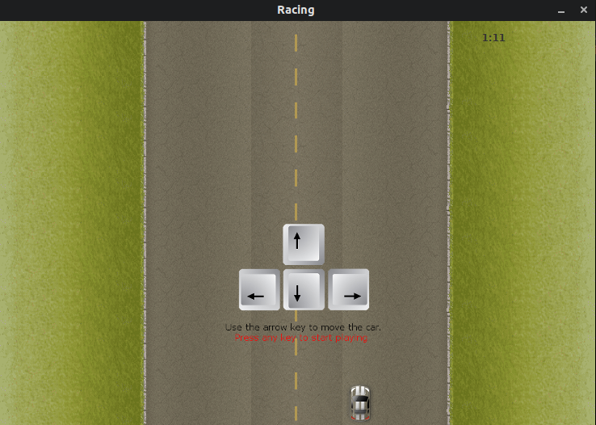
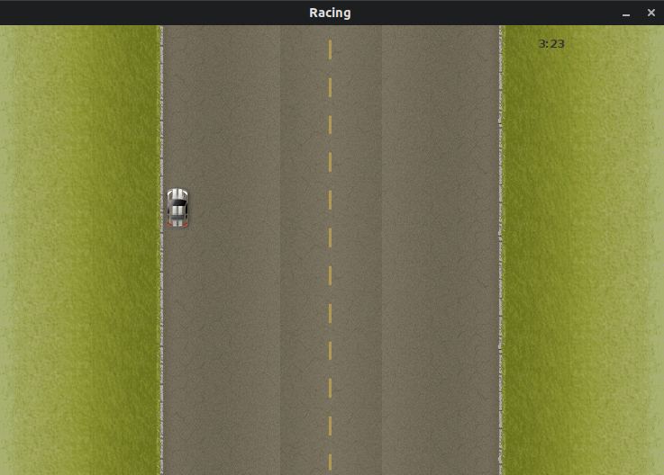
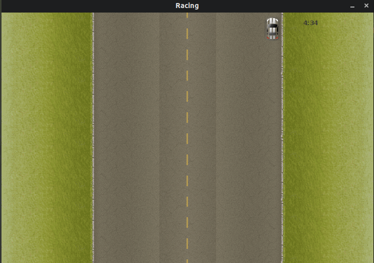

# JAVA-Racing-Game
A simple racing game developed using java swing.
Note:- Duplicating Nokia Racing

Using:
1. Clone the repo in local machine or download repo as Zip on local machine & extract it

    <code>git clone https://github.com/himanshusandha/JAVA-Racing-Game.git</code>
  
2. Traverse to the newly added folder of repo & Open CLI for the folder.

3. Run the command:
  
   <code>javac Racing.java</code>
   
   <code>java Racing</code>
   
Yooo!!!! It's done, enjoy playing the game

<b>Start Screen</b> 

<b>Gameplay screen</b> 

<b>Gameplay screen</b> 

